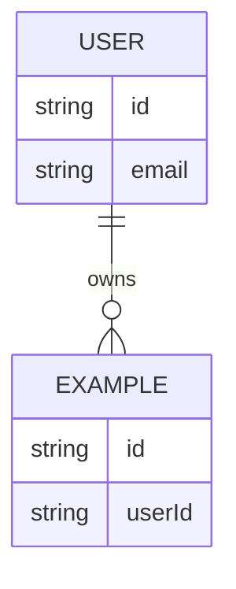
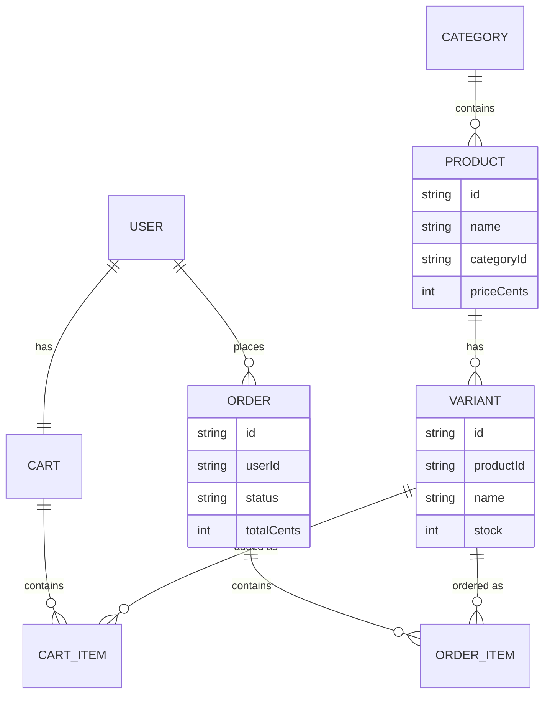

# DOMAIN.md — Project Data Model & Conventions

> **This is a per-project template — fill it in for your app.** It's the place
> where project-specific domain knowledge lives so every agent session shares it
> instead of you re-explaining it. The kit ships it mostly empty on purpose; the
> e-commerce content below is a **sample**, commented out, to show the shape.
> Replace it with your own.

Read this before building features. When a feature changes the data model or a
domain rule, update this file in the same change.

## Entities & relationships

Describe your core entities and how they relate. A Mermaid ER diagram helps the
agent pinpoint where changes go (it renders on GitHub and in many editors):

(The kit already includes `User` and `RefreshToken` for auth — see
`apps/api/prisma/schema.prisma`. Add your domain entities alongside them.)

## Domain conventions

List the project-specific rules that are easy to get wrong and that a green build
won't catch. Examples of the _kind_ of thing to capture (use what applies):

- **Money:** how is currency stored? (A common safe choice: integer minor units —
  cents — never floats, to avoid rounding errors.)
- **Dates/times:** stored in UTC? which timezone does the UI display?
- **IDs:** what format? (the kit uses `cuid` by default.)
- **Soft vs hard deletes:** are records ever truly deleted?
- **Status/enums:** the allowed values for any state machines.
- **Validation rules:** non-obvious constraints (min/max, uniqueness, formats).

## Out of scope / non-goals

What this project deliberately does NOT do (helps the agent avoid scope creep).

---

# <!--

# SAMPLE — E-COMMERCE (delete this whole block; it's only an illustration)

## Entities & relationships (sample)

## Domain conventions (sample)

- Money: all prices/totals are integer **cents** (`priceCents`, `totalCents`),
  never floats.
- Inventory: `stock` is a per-variant integer; checkout must validate against it.
- Variants: products have one or more variants (e.g. size/color); cart and order
  items reference a variant, not a bare product.
- Order status: one of `pending | paid | shipped | cancelled`.
- Checkout: logged-in users only (v1); card data never touches our server
  (hosted payment provider checkout).

## Out of scope (sample)

- Multi-vendor / marketplace. Single store only.
- # Guest checkout (v1).
  -->
